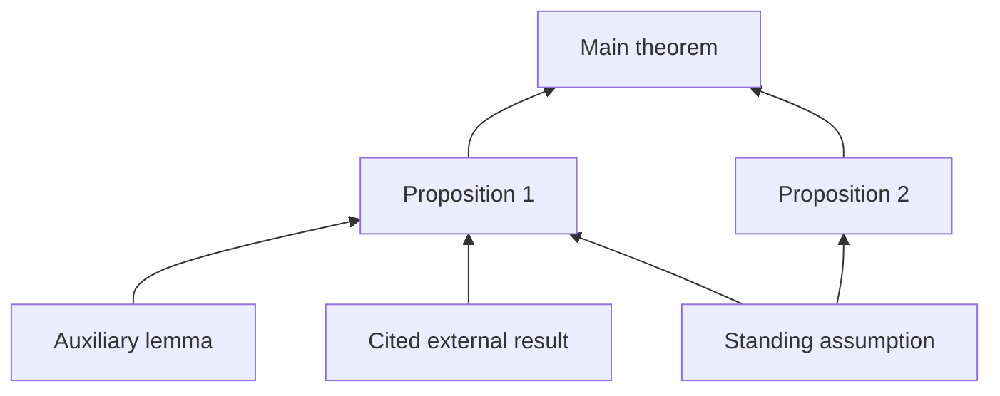

# LeanAutoformalizationSkills

A collection of skills for using Codex or Claude Code to formalize mathematics
in Lean 4. The skills cover project design, Mathlib discovery, proof writing,
performance, independent mathematical audits, and coordinated proof work.

The examples and accumulated guidance lean toward PDE, probability, and
analysis, but the workflows can in principle be used for any area of mathematics.

The central goal is to prove **the theorem the mathematical source actually
states**. A successful Lean build checks the formal statement; the audit
workflows also check that its hypotheses, definitions, quantifiers, and
conclusion match the intended mathematics.

Each skill is a folder containing `SKILL.md` and, where needed, references,
Python helpers, tests, and templates. The same instructions work with both
agents. You can use a single proof-writing skill or the full formalization
workflow.

## Get started

You need Codex or Claude Code. The helper scripts require Python 3.10 or newer
and use the standard library. To check actual proofs, you also need a working
Lean/Lake project with its declared toolchain and dependencies. These skills
provide instructions and checks; they do not install Lean or a proof-search
service.

Clone this repository to a location you intend to keep:

```bash
git clone https://github.com/scottnarmstrong/LeanAutoformalizationSkills.git
cd LeanAutoformalizationSkills
```

While the repository is private, cloning requires an account with access. You
can use `gh repo clone scottnarmstrong/LeanAutoformalizationSkills` if GitHub CLI
is already authenticated.

### Ask your agent to install the skills

Open Codex or Claude Code in the checkout, or give it the checkout's local
path, and paste:

```text
Read README.md in this LeanAutoformalizationSkills checkout and install its
skills for the agent I am using. Include every skill's scripts, references,
assets, tests, and metadata. Use the bundled installer, first with --dry-run.
Preserve any existing skills; report name conflicts before replacing anything.
Then tell me which skills are available and how to invoke lean-workflow.
```

For installation in just one Lean project, add its path and ask for the
installer's `--project` option.

### Install directly

Run the command for your agent from this checkout:

```bash
# Codex: personal installation
python3 scripts/install_skills.py --agent codex --dry-run
python3 scripts/install_skills.py --agent codex

# Claude Code: personal installation
python3 scripts/install_skills.py --agent claude --dry-run
python3 scripts/install_skills.py --agent claude
```

The installer creates a link for each **complete skill folder**. It uses
`~/.agents/skills/` for Codex and `~/.claude/skills/` for Claude Code. These
locations and explicit invocation are documented by
[Codex](https://learn.chatgpt.com/docs/build-skills#where-to-save-skills) and
[Claude Code](https://code.claude.com/docs/en/skills).

For a project installation:

```bash
python3 scripts/install_skills.py --agent codex --project /path/to/your/lean-project
python3 scripts/install_skills.py --agent claude --project /path/to/your/lean-project
```

This creates `.agents/skills/` or `.claude/skills/` in the specified project.
Links require this checkout to remain in place; they are local installations,
not portable files to commit for teammates. To share project skills in Git,
copy the complete folders into the project and preserve their supporting
resources and attributions. An agent should also repair collection-level
attribution links for that copied layout.

The installer stops before creating any links if a conflicting skill already
exists. It never overwrites an installation. Use `--dest /path/to/skills` for
an explicit destination when your agent version or environment uses a
different discovery directory. Where symlinks are unavailable, ask the agent
to copy complete folders and repair collection-level attribution links.

Start a new agent session if the installed skills do not appear. In Codex,
invoke `$lean-workflow`; in Claude Code, invoke `/lean-workflow`. Both agents
can also select a relevant skill from an ordinary request.

## Try it on a Lean project

Start Codex or Claude Code in your **Lean project**, then ask:

```text
Use lean-workflow to help formalize the theorem in this source excerpt.
Read the project's instructions and pinned toolchain first. Identify the
mathematical premises and search Mathlib for the required ingredients.
Show me the complete proposed Lean declaration before freezing it.
```

For an existing proof, a smaller request is enough:

```text
Use lean-search-discovery and lean-proof-patterns to complete this proof.
Preserve the statement, reuse existing Mathlib results, and check the edited
module with this project's build command.
```

A larger development uses the sequence below. The architecture skill prepares
the exact declarations; the graph skill extracts the mathematical source
dependencies; the orchestrator turns those dependencies into bounded proof
tasks and audited results.

## Suggested workflow for a larger formalization

Use a capable reasoning model as the orchestrator. Fable 5.1 or Opus 5.5 are
suggested Claude Code starting points for interpreting sources, designing
declarations, and reviewing mathematical arguments. Choose worker models to
match their tasks and your repository's model and resource policy. These are
model examples, not requirements of the skills or a Lean benchmark ranking.

### Launch the orchestrator in tmux

For long sessions, especially over SSH, tmux makes the terminal easier to
operate: you can detach and return while the session continues, and keep
build logs or separate worker sessions in other panes. It is optional. See the
[tmux getting-started guide](https://github.com/tmux/tmux/wiki/Getting-Started).

First open a session in your Lean project:

```bash
cd /path/to/your/lean-project
tmux new-session -s lean-formalization
```

Inside that session, launch Claude Code with one of these model choices:

```bash
claude --model claude-fable-5-1 --effort high
# Alternatively: claude --model claude-opus-5-5 --effort high
```

Model access depends on your account and provider. Check `/model` and the
[current model configuration documentation](https://code.claude.com/docs/en/model-config)
if a model is unavailable or the model names have changed. The explicit IDs
above select the named versions; aliases such as `fable` and `opus` can change
over time.

Detach with **Ctrl-b**, then **d**. Return with:

```bash
tmux attach-session -t lean-formalization
```

### Paste an orchestration brief

Replace the bracketed fields with your actual source and goal:

```text
Act as the orchestrator using lean-orchestrator and the related installed
skills. My source is [file and theorem/section labels]. My goal is [precise
formalization scope]. Read this repository's instructions, toolchain, build
policy, and existing progress records first.

Start with a small end-to-end pilot. Reconstruct the source mathematics,
propose the complete Lean declarations, obtain independent statement audits,
and show me the exact declarations for approval before freezing them. Then
build and independently review the source dependency graph. Keep source
topology separate from evidence that Lean results are proved.

Use Claude Code's native subagents for bounded Mathlib searches, proof tasks,
and independent audits. Start with a small number of concurrent workers.
Specify each worker's model explicitly: Sonnet is a starting point for routine
searches and straightforward proof tasks; use Fable 5.1 or Opus 5.5 for difficult
mathematical reasoning and statement audits, subject to repository policy.
Give every worker the relevant skill instructions, exact target and source,
allowed dependencies, owned files, validation command, and stop condition.

Keep one owner for frozen declarations, the central graph, and integration.
Workers may edit only their assigned files; reviewers must be independent of
the work they audit. Report an inadequate API or source ambiguity instead of
changing a frozen statement or adding a missing proof step as a hypothesis.
Apply both audit seals and keep drafts visibly unproved and quarantined.

Maintain durable progress and handoff records. After each integration, report
the exact declarations checked, build and axiom results, audit findings, and
remaining obligations. Preserve other sessions' work and dependency caches.
```

Ask Claude to delegate directly; it launches subagents through its native
`Agent` tool. For reusable worker definitions, ask it to create project agents
under `.claude/agents/` with explicit `model` and `skills` fields. Include the
relevant skills in each worker's brief or preload them in its definition.
See [Claude Code subagents](https://code.claude.com/docs/en/sub-agents).

Codex users can reuse the mathematical brief with their available delegation
mechanism and model choices; the CLI commands above are specific to Claude
Code.

### Optional: visible worker panes

Ordinary subagents report back to the lead. For separately visible teammates,
Claude Code's experimental **agent teams** support tmux split panes. Inside
the tmux session, an optional launch is:

```bash
CLAUDE_CODE_EXPERIMENTAL_AGENT_TEAMS=1 claude --model claude-fable-5-1 --effort high --teammate-mode tmux
```

Ask explicitly for a team with bounded roles, owned files, and independent
reviewers. This changes delegation behavior and uses separate Claude sessions;
use it when direct teammate coordination is useful. Team mode is experimental
and has resumption limitations, so keep durable handoffs. Check the
[current agent-team documentation](https://code.claude.com/docs/en/agent-teams)
before adopting it.

## Source dependency graphs

`build-proof-dependency-graph` records how the mathematical argument works.
Roots are anchored to exact author-approved Lean declarations. Other nodes
represent results, definitions, substantive proof steps, standing assumptions,
or cited external inputs. Each dependency records where the consumer uses its
prerequisite in the source.



Arrows in this illustration point from prerequisites to the results they support.
In the database, a result's `DEPS` list records its prerequisites; all listed
inputs are required. Alternative proofs use separate `ROUTES` nodes: one route may
suffice. A coverage manifest accounts for source statements, reused displays,
and substantive proof regions. Missing source arguments remain visible as
`SOURCE_GAP` records.

The bundled Python checker validates structure, source locators, cycles,
coverage records, independent reviewer identities, and frozen-anchor identity.
It can regenerate a dashboard or emit JSON. **It does not certify the
mathematics or decide whether Lean proofs are complete.** Lean proof evidence
and status are maintained separately by the formalization workflow.

## The two audit seals

The workflow has two independent review gates:

1. **Statement seal.** Pin the mathematical source and any author rulings.
   Elaborate the complete proposed Lean declaration. An independent reviewer
   checks every binder, implicit argument, carrier, definition, constant
   dependency, and conclusion against the source. The author approves the
   complete command, which is frozen in a one-declaration file and manifest.
2. **Proof seal.** Prove the exact frozen statement using independently checked
   prerequisites. Integrate its proof without changing the approved statement,
   compile it, inspect its axioms and dependencies, and obtain a fresh source
   and semantics audit. Completion requires evidence from both the prover and
   an independent auditor.

A frozen draft theorem may contain one explicitly authorized, manifest-bound
`by sorry`. It is **unproved** and quarantined from proved dependencies.
Definitions must already denote the intended objects; they cannot contain
placeholder bodies. A definition specified by unique characterization requires
its exact existence-and-uniqueness theorem before construction by unique choice.

Proof steps belong in lemmas and proofs. Adding a missing estimate as a
hypothesis does not prove the original theorem. Changing a frozen statement
requires renewed author approval, a versioned successor, and renewed audits.

## Coordinating larger proofs

`lean-orchestrator` gives workers bounded tasks with exact inputs, approved
statements, disjoint write sets, and explicit handoffs. One orchestrator owns
integration. Fresh reviewers try to refute proposed results against the source;
the agent that wrote a proof does not certify it alone.

The dependency graph supplies the mathematical task structure. Separate Lean
evidence identifies which prerequisites are actually available. Model choice,
parallelism, build commands, cache policy, and file limits follow the target
repository's instructions.

## Skills included

| Skill | Use it for |
| --- | --- |
| `lean-workflow` | Choose the right workflow and respect repository/build policy |
| `lean-project-architecture` | Design exact declarations, module boundaries, and reusable APIs |
| `build-proof-dependency-graph` | Extract and independently review source proof dependencies |
| `lean-orchestrator` | Coordinate bounded proof tasks, independent review, and integration |
| `lean-statement-audit` | Check exact source correspondence, binders, semantics, and axioms |
| `lean-search-discovery` | Find existing Mathlib declarations before reproving them |
| `lean-proof-patterns` | Translate mathematical reasoning into maintainable Lean proofs |
| `lean-naming-style` | Follow Mathlib naming, documentation, and organization conventions |
| `lean-learnings` | Reuse detailed analysis, probability, and elaboration patterns |
| `lean-elaboration` | Diagnose measured elaboration bottlenecks and compare fixes |
| `lean-elaboration-test` | Produce a repeatable repository performance report |
| `lean-public-release` | Prepare a formalization repository for an approved public release |

[INDEX.md](INDEX.md) links directly to each skill. References are loaded when
needed; installing the collection does not require reading it all at once.

## Python helpers and templates

The scripts travel with their skills:

| Helper | Purpose |
| --- | --- |
| [proof_depgraph.py](skills/build-proof-dependency-graph/scripts/proof_depgraph.py) | Validate and render source dependency graphs |
| [check_frozen_anchors.py](skills/lean-orchestrator/scripts/check_frozen_anchors.py) | Check manifest identity, frozen file boundaries, provider bodies, and draft quarantine |
| [check_lean_modules.py](skills/lean-project-architecture/scripts/check_lean_modules.py) | Check the declared module-header and visibility policy |
| [count_lean_lines.py](skills/lean-elaboration-test/scripts/count_lean_lines.py) | Count Lean files while separating comment-only material |
| [install_skills.py](scripts/install_skills.py) | Install whole skill folders without replacing existing skills |
| [verify_repository.py](scripts/verify_repository.py) | Check this collection's metadata, resources, and local links |

Run a helper with `--help` for its actual options. Graph and frozen-anchor
templates are under the corresponding skill's `assets/` directory. Adapt them
to a real project; the templates are not completed audit evidence.

For a release scrub, the verifier accepts `--forbidden-patterns /path/to/patterns.txt`,
an external list of case-insensitive regular expressions, one per line. Keep
private identifiers in that external file. This scans exported paths and every
regular UTF-8 text file outside Git metadata and Python caches, including root
documents, metadata, templates, hidden files, and extensionless files. Binary
contents require separate review. Structural checks and name
scans support a separate semantic review; neither certifies complete privacy
or mathematical correctness.

To check this checkout:

```bash
python3 scripts/verify_repository.py
PYTHONDONTWRITEBYTECODE=1 python3 skills/build-proof-dependency-graph/scripts/test_proof_depgraph.py
PYTHONDONTWRITEBYTECODE=1 python3 skills/lean-orchestrator/tests/test_check_frozen_anchors.py
PYTHONDONTWRITEBYTECODE=1 python3 skills/lean-project-architecture/tests/test_check_lean_modules.py
PYTHONDONTWRITEBYTECODE=1 python3 -m unittest discover -s tests
```

## License and attribution

Copyright © 2026 Scott Armstrong. The original portions of this collection,
including the skill instructions, references, templates, and Python helpers,
are licensed under the
[Creative Commons Attribution 4.0 International License](https://creativecommons.org/licenses/by/4.0/)
(CC BY 4.0); the full legal code is in [LICENSE](LICENSE). You may share and
adapt this material for any purpose, including commercially, provided you give
appropriate credit, link to the license, and indicate if changes were made.
A suitable attribution is:

> LeanAutoformalizationSkills by Scott Armstrong,
> <https://github.com/scottnarmstrong/LeanAutoformalizationSkills>, licensed
> under CC BY 4.0.

Third-party portions retain their own license terms. Adapted MIT material and
Apache-2.0-derived material are identified in
[THIRD_PARTY_NOTICES.md](THIRD_PARTY_NOTICES.md); the Apache license text is in
[LICENSES/Apache-2.0.txt](LICENSES/Apache-2.0.txt). Public guidance sources are
listed in [SOURCES.md](SOURCES.md), and adaptation details are in
[PROVENANCE.md](PROVENANCE.md).
